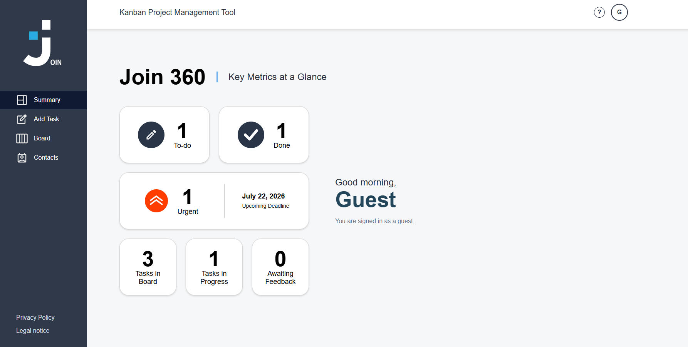

<div align="center">


# Join 360

</div>

<div align="center">


</div>

<div align="center">


</div>

<div align="center">

Join is a responsive Kanban project management application for organizing tasks,
tracking progress and collaborating through a shared Firebase data store.
It provides authenticated and guest access to the same board, contacts and task workflow.

</div>

## Live Demo

[Open Join 360](https://join-teamjob.web.app/)

## Preview



## Table of Contents

- [Features](#features)
- [Tech Stack](#tech-stack)
- [Application Architecture](#application-architecture)
- [Requirements](#requirements)
- [Quickstart](#quickstart)
- [Firebase Setup](#firebase-setup)
- [Usage](#usage)
- [Project Structure](#project-structure)
- [Automated Tests](#automated-tests)
- [Deployment](#deployment)
- [Learning Goals](#learning-goals)

## Features

| Feature | Description |
| --- | --- |
| Authentication | Sign up and sign in with Firebase Authentication. |
| Guest access | Test the application anonymously while using the shared task and contact data. |
| Summary | View live task totals, status metrics, urgent tasks and the next upcoming deadline. |
| Add Task | Create tasks with a title, description, due date, priority, category, assignees and subtasks. |
| Board | Organize tasks across To do, In progress, Await feedback and Done. |
| Task editing | Edit, move and delete existing tasks directly from the board. |
| Subtasks | Add, edit, remove and complete individual subtasks. |
| Search | Filter board cards by task title or description. |
| Contacts | Create, edit and delete contacts and display the signed-in user in the contact list. |
| Shared data | Store tasks and contacts centrally in Cloud Firestore. |
| Responsive design | Use the application on desktop, tablet and mobile layouts. |

## Tech Stack

| Technology | Purpose |
| --- | --- |
| HTML5 | Semantic page and component structure |
| CSS3 | Responsive layouts, Figma-based styling and interaction states |
| JavaScript ES6+ | Routing, rendering, validation and application logic |
| Firebase Authentication | Email/password and anonymous guest authentication |
| Cloud Firestore | Shared task and contact persistence |
| Firebase Hosting | Public deployment of the application |
| Node.js test runner | Automated tests for central application logic |

## Application Architecture

Join uses a multi-page architecture. The HTML files in the project root are
small route entry documents. `main.js` loads the matching page component and,
for protected pages, the shared application layout.

Visible markup is organized according to Atomic Design:

- `atoms` contain the smallest reusable UI elements.
- `molecules` combine atoms into focused controls.
- `organisms` provide larger reusable interface sections.
- `pages` contain route-specific content.
- `templates` provide shared page layouts.

The JavaScript layer separates rendering, validation, stores, Firebase adapters
and feature-specific interactions into focused files.

## Requirements

- A modern web browser
- A local development server, such as the VS Code Live Server extension
- Node.js when running the automated tests or Firebase CLI commands
- An internet connection for Firebase Authentication and Firestore
- Access to the shared `join-teamjob` Firebase project for local Firebase setup

The hosted live demo can be opened without a local installation.

## Quickstart

1. Clone the repository:

```bash
git clone https://github.com/willidevac/Join.git
```

2. Open the project directory:

```bash
cd Join
```

3. Complete the local [Firebase setup](#firebase-setup).

4. Start a local web server. For example:

```powershell
python -m http.server 5500 --bind localhost
```

5. Open Join in the browser:

```text
http://localhost:5500/index.html
```

Do not open the application directly through a `file://` URL.

## Firebase Setup

Join expects a local Firebase web configuration file at:

```text
components/js/firebaseConfig.js
```

This file is intentionally ignored by Git and must never be committed. Each
team member needs access to the Firebase project `join-teamjob` and creates the
file locally.

### Retrieve the configuration with the Firebase CLI

Check Node.js and the current Firebase CLI:

```powershell
node --version
npx -y firebase-tools@latest --version
```

Sign in and select the shared project:

```powershell
npx -y firebase-tools@latest login
npx -y firebase-tools@latest projects:list
npx -y firebase-tools@latest use join-teamjob
```

List the registered apps and copy the App ID of the `WEB` app:

```powershell
npx -y firebase-tools@latest apps:list --project join-teamjob
$appId = "PASTE_THE_WEB_APP_ID_HERE"
```

Retrieve the SDK configuration and create the ignored local file:

```powershell
$config = (
  npx -y firebase-tools@latest apps:sdkconfig WEB $appId --project join-teamjob |
  Out-String
).Trim()

"window.joinFirebaseConfig = $config;`r`n" |
  Set-Content -Encoding utf8 .\components\js\firebaseConfig.js
```

Verify the generated file without printing all configuration values:

```powershell
Test-Path .\components\js\firebaseConfig.js
node --check .\components\js\firebaseConfig.js
Select-String -Path .\components\js\firebaseConfig.js -Pattern "projectId|authDomain"
git check-ignore -v .\components\js\firebaseConfig.js
```

The configuration must reference the Firebase project `join-teamjob`. If the
project does not appear in `projects:list`, ask a Firebase project owner to add
your Google account. Do not create a separate Firebase project for local work.

Without the local configuration file, email/password login, guest login,
Firestore tasks and Firestore contacts are unavailable.

> [!IMPORTANT]
> Never commit passwords, private credentials, service-account files, API
> secrets or admin keys to this repository.

### Troubleshooting: Unauthorized OAuth domain

If the browser console reports that the current domain is not authorized for
OAuth operations, check the address used to open Join. Firebase treats
`localhost` and `127.0.0.1` as different domains.

Use the local address from this guide whenever possible:

```text
http://localhost:5500/index.html
```

If Join must be opened through `127.0.0.1`, add `127.0.0.1` in the Firebase
Console under `Authentication` -> `Settings` -> `Authorized domains`. Enter
only the hostname, without `http://`, a port or a path.

This warning primarily affects OAuth popup and redirect operations. It does
not mean that credentials should be added to the repository.

## Usage

- Create an account or use the guest login.
- Review task totals and the next deadline on the Summary page.
- Create a task through Add Task or from a Board column.
- Assign contacts, choose a priority and add subtasks.
- Move task cards between the four workflow columns.
- Open a task card to edit its data or complete individual subtasks.
- Search the board by task title or description.
- Manage contacts from the Contacts page.

Guest and authenticated users work with the same shared Firestore data set.

## Project Structure

```text
.
|-- components/
|   |-- assets/
|   |   `-- img/
|   |-- css/
|   |   |-- molecules/
|   |   |-- organisms/
|   |   `-- pages/
|   |-- html/
|   |   |-- atoms/
|   |   |-- molecules/
|   |   |-- organisms/
|   |   |-- pages/
|   |   `-- templates/
|   `-- js/
|       |-- firebaseAuth.mjs
|       |-- firebaseContacts.mjs
|       |-- firebaseTasks.mjs
|       `-- feature and store modules
|-- tests/
|-- addTask.html
|-- board.html
|-- contacts.html
|-- index.html
|-- signup.html
|-- summary.html
|-- base.css
|-- main.js
|-- firebase.json
|-- firestore.rules
`-- README.md
```

## Automated Tests

The repository contains automated tests for important logic paths, including:

- task storage and date normalization
- summary metrics and upcoming deadlines
- board search
- board edit validation
- assignee normalization
- contact names and email validation
- privacy-policy consent
- asynchronous error handling

Run the complete test suite from the project root:

```bash
node --test
```

## Deployment

The application is deployed with Firebase Hosting:

```text
https://join-teamjob.web.app/
```

Before a deployment, verify the working tree, run the automated tests and test
the main user stories on desktop and mobile resolutions.

## Learning Goals

Join is a team-based frontend learning project. Important practice areas are:

- translating a Figma design into responsive interfaces
- structuring markup with Atomic Design
- writing small and focused JavaScript functions
- separating rendering, persistence and Firebase adapters
- implementing authentication and shared Firestore data
- handling asynchronous errors with clear user feedback
- validating forms and maintaining accessible interactions
- testing central application logic automatically
- collaborating through Git, GitHub and task-based workflows
